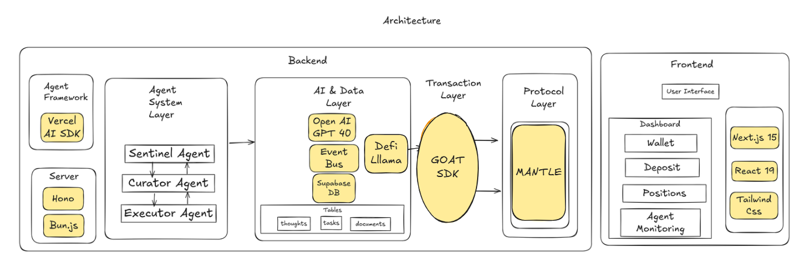

# 🤖 NectaFi

NectaFi is an agentic platform for automated DeFi yield optimization and portfolio management, built primarily on Mantle Network. The platform automates and optimizes your stablecoin yield strategies across multiple DeFi protocols, maximizing returns with no manual tracking – fully on-chain and self-custodial.

## Features 🌟

-   **Multi-Agent Intelligence**: Three specialized AI agents (Sentinel, Curator, and Executor) collaborate to automatically optimize yields across multiple protocols
-   **Automated Rebalancing**: Continuously rebalances your portfolio to maximize returns
-   **Self-Custodial**: Fully on-chain and non-custodial
-   **DeFi UX Abstraction**: Simplifies complex DeFi interactions into a seamless experience

## Architectural Diagram:



## Project Structure 📁

```
necta-fi/
├── frontend/           # Next.js frontend application
│   ├── app/           # App router pages
│   ├── components/    # React components
│   └── lib/          # Utilities and constants
└── agents/           # Backend agent system
    ├── src/
    │   ├── agents/   # Agent implementations
    │   ├── data/     # Data providers integration
    │   └── config/   # Chain and protocol configs
```

## Tech Stack 🛠️

### Frontend

-   **Framework**: Next.js 15
-   **Language**: TypeScript
-   **Styling**: Tailwind CSS + Shadcn UI
-   **State Management**: Zustand
-   **Web3 Integration**:
    -   Wagmi v2
    -   Viem
    -   ConnectKit
-   **UI Components**:
    -   Radix UI
    -   Framer Motion
    -   Sonner
-   **Development**:
    -   Biome (Linting/Formatting)
    -   T3 Env (Environment Variables)

### Backend (Agents)

-   **Runtime**: Bun + Hono
-   **Database**: Supabase
-   **AI Integration**:
    -   OpenAI GPT-4
    -   Vercel AI SDK
-   **Data Providers**:
    -   Defilama API
        **Onchain execution layer:**
    -   Goat SDK

### Networks

-   Primary: Mantle Network
-   Secondary: Base, Arbitrum

## Quick Start 🚀

### Prerequisites

-   Node.js 20+
-   Bun
-   Git

### Installation

1. Clone the repository:

```bash
git clone https://github.com/samueldanso/necta-fi.git
cd necta-fi
```

2. Install dependencies:

```bash
# Install frontend dependencies
cd frontend
bun install

# Install agent dependencies
cd ../agents
bun install
```

3. Set up environment variables:

```bash
# Frontend
cd frontend
cp .env.example .env

# Agents
cd ../agents
cp .env.example .env
```

Required environment variables:

-   Frontend:
    -   \`NEXT_PUBLIC_APP_URL\`
    -   \`NEXT_PUBLIC_API_URL\`
-   Agents:
    -   \`OPENAI_API_KEY\`
    -   \`SUPABASE_URL\` & \`SUPABASE_KEY\`
    -   \`DEFILAMA\`
    -   \`GOAT SDK\`

4. Start the development servers:

```bash
# Start frontend
cd frontend
bun dev

# Start agents
cd ../agents
bun dev
```

## User Flow 🔄

1. Connect Wallet
2. Deposit USDC
3. Activate Agents
4. Automated Yield Optimization Begins

## Security 🛡️

-   Non-custodial architecture
-   Real-time transaction simulation
-   Comprehensive error handling
-   Secure API integrations

## Development 👨‍💻

### Frontend Development

```bash
cd frontend
bun dev
```

### Agent Development

```bash
cd agents
bun dev
```

## Contributing 🤝

Contributions are welcome! Please feel free to submit a Pull Request.

## License 📄

MIT License - See [LICENSE](LICENSE) for details

## Disclaimer ⚠️

This code is provided as-is with no guarantees. Not audited. Use at your own risk. Not financial advice.
