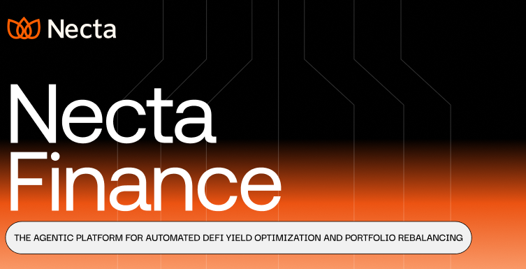

<a href="https://nectafi.xyz">
  
  <h1 align="center">NectaFi - The agentic platform for automated DeFi yield optimization and portfolio management.</h1>
</a>

<p align="center">
   Necta automates and optimizes your stablecoin yield strategies across multiple DeFi protocols. Maximize returns with no manual tracking – fully on-chain and self-custodial.
</p>

 <!-- <p align="center">
   <a href="#features"><strong>Features</strong></a> ·
  <a href="#tech-stack"><strong>Tech Stack</strong></a> ·
  <a href="#setup"><strong>Setup</strong></a> ·
  <a href="#roadmap"><strong>Roadmap</strong></a>
</p>
<br/> -->

## Features

- **Multi-Agent Intelligence:** Three specialized AI agents Sentinel, Curator and Executor collaborate to automatically optimize yields across multiple protocols, securing the highest APYs effortlessly.
- **Automated Rebalancing:** Continuously rebalances your portfolio to maximize returns-no manual tracking required.
- **Self-Custodial:** Fully on-chain and self-custodial.
- **DeFi UX Abstraction:** Simplifies the complex DeFi UX.

## Tech Stack

- **Frontend:** [Next.js 14](https://nextjs.org), [Tailwind CSS](https://tailwindcss.com), [Shadcn UI](https://ui.shadcn.com/),
- **Backend:** [Bun](https://bun.sh/), [Hono](https://hono.dev/), [Supabase](https://supabase.com/)
- **Agent Framework:** [Vercel AI SDK](https://www.vercel.com/ai-sdk)
- **LLM :** [OpenAI](https://openai.com/)
- **Ethereum Client:** [wagmi](https://wagmi.sh) & [viem](https://viem.sh)
- **Connect Wallet:** [Connectkit](https://connectkit.xyz/)
- **Onchain Execution Layer:** [Brahma Console-kit](https://consolekit.brahma.fi//)
- **Yield Aggregator:** [Stakeit API](https://stakeit.xyz/)

## How it works

1. Connect Wallet
2. Deploy Safe Account
3. Deposit Funds (USDC)
4. Activate Agent

## Setup

1. Clone the repository

   ```bash
   git clone https://github.com/NectaFi/necta-app
   ```

2. Install dependencies

   ```bash
   bun install
   ```

3. Copy the `.env.example` to `.env` and update the variables.

   ```bash
   cp .env.example .env
   ```

4. Start the development server

   ```bash
   bun dev
   ```

## Deploy

Follow the deployment guides for [Vercel](https://nextjs.org/learn-pages-router/basics/deploying-nextjs-app/deploy).

## Agents

Backend Repository: [necta-agents](https://github.com/NectaFi/necta-agents)

## Contributing

Contributions are welcome! Please feel free to open an issue or submit a pull request.

/ # Landing page with clear value proposition
├── /app # Main entry point after connecting wallet
├── /setup # Deploy smart account & initial deposit
└── /dashboard # Combined dashboard with everything important
